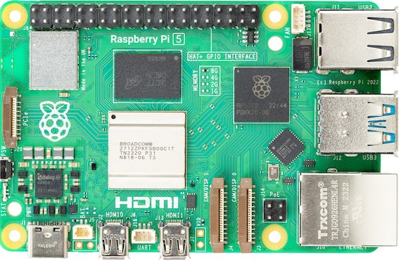
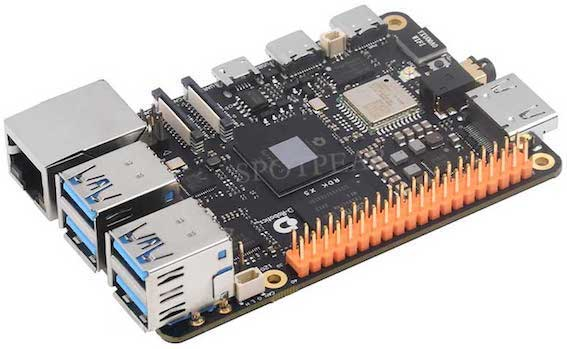
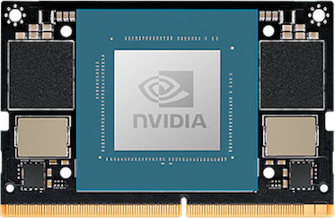
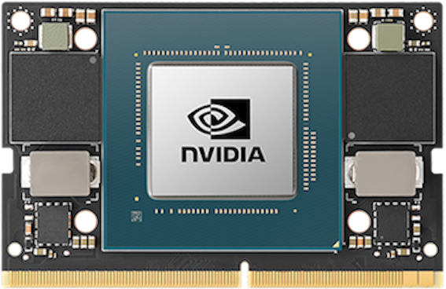
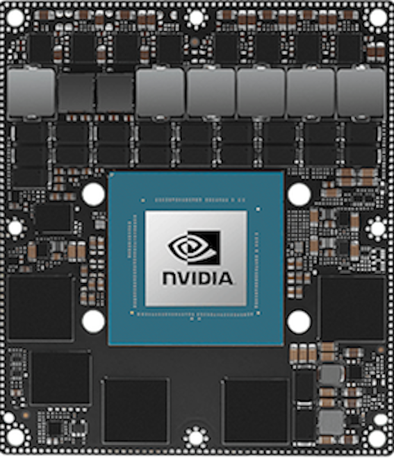
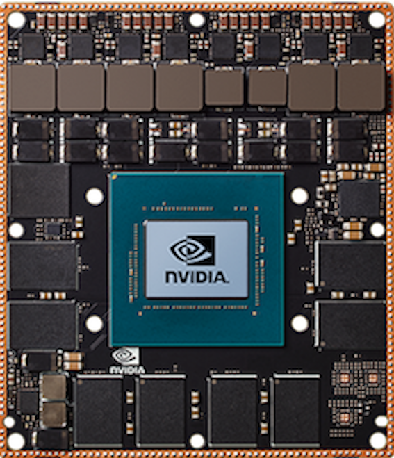
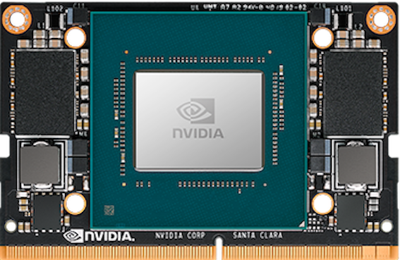
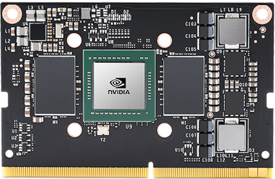
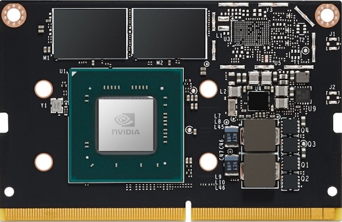

## Hi there 👋

**wheelos** is a new autonomous driving system, you can find the design documentation here.

[中文](https://cx8sal2qit.feishu.cn/wiki/YOSmwe8qZiui6IkxIQScz7SMnzJ?from=from_copylink)

<!--

**Here are some ideas to get you started:**

🙋‍♀️ A short introduction - what is your organization all about?
🌈 Contribution guidelines - how can the community get involved?
👩‍💻 Useful resources - where can the community find your docs? Is there anything else the community should know?
🍿 Fun facts - what does your team eat for breakfast?
🧙 Remember, you can do mighty things with the power of [Markdown](https://docs.github.com/github/writing-on-github/getting-started-with-writing-and-formatting-on-github/basic-writing-and-formatting-syntax)
-->

## Supported Hardware

| **Model**              | **Image**                                              | **Supported** |
|------------------------|-------------------------------------------------------|---------------|
| Raspberry Pi 5        |        | Yes           |
| D-Robotics RDK™ X5    |     | No            |
| D-Robotics J6         |                                                       | No            |
| Jetson Orin Nano      |      | Yes           |
| Jetson Orin NX        |        | Yes           |
| Jetson AGX Orin       |       | Yes           |
| Jetson AGX Xavier     |     | Yes           |
| Jetson Xavier NX      |      | Yes           |
| Jetson TX2            |            | Yes           |
| Jetson Nano           |          | Yes           |

